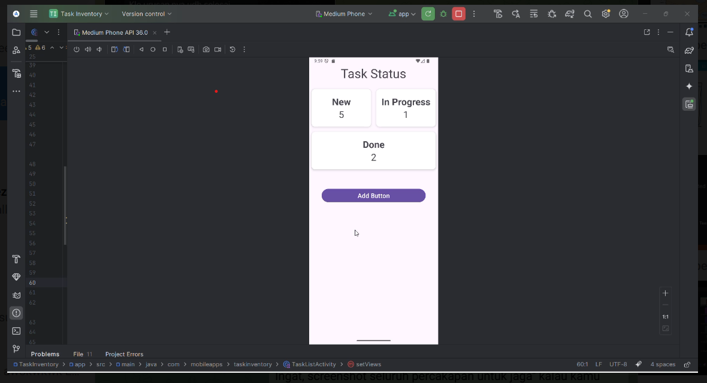

# 📱 Task Inventory App (Notes / Task Manager)

A simple Android application for managing tasks using a local database (Room).  
This project was migrated from Firebase-based storage to fully offline storage using Room Persistence Library.

---

## 🚀 Full Video Demonstration
[](https://drive.google.com/file/d/1MBjgNkkbtIiXKqOhhLExr-AYQQd57zrp/view?usp=sharing)
---

## 🚀 Tech Stack

- Kotlin
- Android SDK
- Room Database (Local Storage)
- MVVM/MVP-like architecture (Presenter + Model separation)
- RecyclerView
- Coroutines (LifecycleScope)
- AlertDialog UI

---

## 📦 Build Information

This APK is generated from **debug variant**:

```json
{
  "version": 3,
  "artifactType": {
    "type": "APK",
    "kind": "Directory"
  },
  "applicationId": "com.mobileapps.taskinventory",
  "variantName": "debug",
  "elements": [
    {
      "type": "SINGLE",
      "versionCode": 1,
      "versionName": "1.0",
      "outputFile": "app-debug.apk"
    }
  ],
  "minSdkVersionForDexing": 24
}
```
📌 Output file:
app-debug.apk (we rename it to: TaskInventory.apk)

---

📱 Features
==========

### ✅ Task Management
- Add new task  
- Edit task status  
- Delete task  
- View task list by status:
  - New
  - In Progress
  - Done

---

### 📊 Dashboard
- Count tasks per status  
- Real-time update using Room queries  

---

### 📂 Task Fields
Each task contains:
- Title  
- Description  
- Category (Normal / Urgent / Important)  
- Status (New / In Progress / Done)  
- Created time  
- Finished time  
- Duration  

---

🏗 Architecture Overview
=======================

### Before (Firebase-based)
- Retrofit API  
- Remote JSON database  
- Network dependency  

---

### After (Current Version)
- Room Database (SQLite local storage)  
- Fully offline-first  
- No backend dependency  

---

🔁 Data Flow
===========

UI (Activity / Fragment)  
↓  
Presenter  
↓  
Model (Repository Layer)  
↓  
Room DAO  
↓  
SQLite Database  

---

🧠 Key Design Decisions
=======================

### 1. Migration from Firebase → Room
The project was refactored from cloud-based Firebase API to local persistence using Room for:
- Offline support  
- Faster performance  
- Reduced dependency complexity  

---

### 2. Presenter-based architecture
Business logic is separated from UI:
- Presenter handles logic  
- Model handles data access  
- View (Activity/Fragment) handles UI only  

---

### 3. Enum-based status system
Task status is controlled using:
- NEW  
- IN_PROGRESS  
- DONE  

This ensures consistency across UI and database queries  

---

⚙️ Build & Run
==============

### Debug Build (Current)
Build → Build Bundle(s) / APK(s) → Build APK(s)

Then locate:
app/build/outputs/apk/debug/app-debug.apk

Install manually on device.

---

🧪 Known Characteristics
=======================
- Data is stored locally on device only  
- No cloud sync  
- Data will be lost if app is uninstalled  
- No authentication system required  

---

📌 Notes
========
This project is intended for:

- Learning Android architecture  
- Practicing Room Database  
- Understanding offline-first mobile apps  
- MVP/MVC-style separation of concerns  

---

⚙️ Contributors
==============
- Gracia Naimora Samosir    (IBDA/222100986)
- Shindy Estera             (IBDA/232201332)     